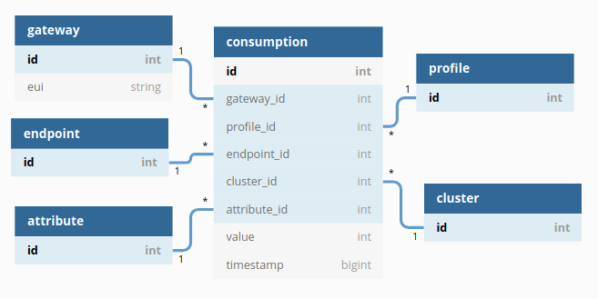

# RabbitMqDemoProject

This is a simple project that consumes JSON data from an API, sends them to a RabbitMQ instance where they are filtered
and then, consumes the data from the queue and stores them into a database.

## Prerequisites

This project was developed with PHP 7.3.15 and Symfony 4.4.5.

## Setting Up

- You must set up the database URL (DATABASE_URL) under .env
- You must set up the parameters in config/services.yaml. These parameters are for the api endpoint where we fetch the data
and for the connection to the RabbitMQ.

## Functionality

### Routes

In the following table we have the available routes that can be used.
The code for them can be found in DataController.php and QueueController.php.

```
 ------------------- -------- -------- ------ -------------------------- 
  Name                Method   Scheme   Host   Path                      
 ------------------- -------- -------- ------ -------------------------- 
  _preview_error      ANY      ANY      ANY    /_error/{code}.{_format}  
  data.fetch          ANY      ANY      ANY    /data/fetch               
  data.gateways       ANY      ANY      ANY    /data/gateways            
  data.profiles       ANY      ANY      ANY    /data/profiles            
  data.endpoints      ANY      ANY      ANY    /data/endpoints           
  data.clusters       ANY      ANY      ANY    /data/clusters            
  data.attributes     ANY      ANY      ANY    /data/attributes          
  data.consumptions   ANY      ANY      ANY    /data/consumptions        
  queue.post          ANY      ANY      ANY    /queue/post               
  queue.consume       ANY      ANY      ANY    /queue/consume            
  queue.consumeAll    ANY      ANY      ANY    /queue/consumeAll         
 ------------------- -------- -------- ------ -------------------------- 

```

#### data.fetch

This fetches JSON data from a remote API and returns them again in JSON format.
This is just a wrapper for the remote API. It doesn't modify the data in any way.

#### data.gateways/profiles/endpoints/clusters/attributes/consumptions

This returns all the relevant data from that database table.

#### queue.post

This route will use data.fetch to get the JSON data and post them to a RabbitMQ exchange.
The query parameter "messages" can be given to select the number of messages to send to the exchange (default is 1).
The value of the parameter must be an integer in the range [1-10].

It will return the data that was posted to  the queue in a small table.

#### queue.consume

This route will consume a message from the RabbitMQ queue and store it's data to a database table.

It will return a small table with the consumed message data or a relevant message if the queue is empty.

#### queue.consumeAll

This route will consume all messages found in the queue until it's empty and store them to the database.

It will return a small table with the posted messages or a relevant message if the queue is empty.

### Database Definition

In the following image we can see the database tables that are used to store all the API information.

